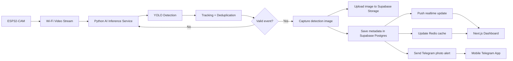

# Smart Railway Real-Time Object Detection System
## Complete architecture and implementation spec for an AI coding agent

Version: 1.0  
Purpose: Build a full-stack smart railway safety platform with ESP32-CAM video input, AI object detection, realtime dashboard, cloud database, image storage, Telegram alerts, and analytics.

---

## 1. Project goal

Build a railway monitoring system that:

- reads live video from **ESP32-CAM**,
- detects objects in realtime with a **pretrained YOLO model**,
- captures the detection frame only when a valid object is seen,
- uploads the detection image to cloud storage,
- saves event metadata in **Supabase Postgres**,
- uses **Redis only as cache and realtime helper**, not as the main database,
- updates a live web dashboard instantly,
- sends a **Telegram photo alert** to mobile,
- provides analytics, history, filters, and incident review,
- keeps the architecture modular so an AI coding agent can implement it cleanly.

---

## 2. Recommended technology stack

### Camera layer
- **ESP32-CAM** as the prototype camera node.
- Stream video over Wi‑Fi using HTTP/MJPEG style streaming.
- Keep the resolution moderate for reliable realtime inference.

### AI / inference layer
- **Python 3.11+**
- **Ultralytics YOLO** for object detection
- **OpenCV** for stream capture and frame handling
- **ByteTrack** or equivalent tracking layer for dedupe and stable IDs

### Backend layer
- **FastAPI** for APIs, background jobs, and WebSockets
- Async processing for uploads and notifications
- Strong separation between inference and API logic

### Database and storage
- **Supabase** as the main cloud backend
  - Postgres database
  - Storage for images
  - Realtime subscriptions
  - Auth for dashboard users
- **Redis** for:
  - live counters
  - cache
  - cooldown keys
  - short-lived event queues

### Frontend layer
- **Next.js App Router**
- React-based dashboard
- Mobile responsive
- realtime event stream and analytics

### Notifications
- **Telegram Bot API** with `sendPhoto`

---

## 3. Why this stack is recommended

### Supabase as the main database
Use Supabase as the source of truth because it gives you a full Postgres database, Auth, Storage, and Realtime in one platform. This keeps the system simple and production-friendly.

### Redis as cache only
Redis should not hold permanent detections. Use it only for:
- recent event cache,
- detection cooldown,
- dashboard counters,
- transient queues,
- camera online/offline status.

### YOLO for realtime detection
Ultralytics YOLO is a strong fit because it is designed for realtime object detection, supports pretrained models, and provides a simple Python API. For a laptop-based inference server, a small model like `yolo11n.pt` or `yolo26n.pt` is a good starting point.

### FastAPI for backend
FastAPI is fast, clean, and supports background tasks and WebSockets, which are useful for realtime dashboards and non-blocking alert delivery.

### Next.js for dashboard
The App Router is a good fit for a modern dashboard with pages, reusable layouts, server/client split, and realtime UI.

### Telegram alerts
Telegram Bot API supports photo messages directly, which makes it ideal for incident alerts with images.

---

## 4. Final system architecture



---

## 5. End-to-end detection pipeline

1. ESP32-CAM streams live video.
2. Python service reads frames.
3. YOLO runs on each frame or on sampled frames.
4. Tracking layer gives the object a stable ID.
5. Deduplication checks whether the object already triggered an alert.
6. If valid, the system captures one image snapshot.
7. Snapshot uploads to Supabase Storage.
8. Detection metadata saves in Supabase Postgres.
9. Redis stores recent state and counters.
10. Backend pushes realtime update to the dashboard.
11. Telegram bot sends alert with photo.
12. Dashboard shows detection in live feed, history, and analytics.

---

## 6. System rules

### Core rules
- Save permanent data only in Supabase Postgres.
- Use Redis only as temporary cache.
- Never send Telegram alerts for every frame.
- Capture only one image per confirmed event.
- Never block the detection loop on image upload or Telegram send.
- Use tracking and cooldown to prevent duplicate events.
- Keep the dashboard realtime-first.
- Keep all secrets in backend environment variables only.

### Detection rules
- Ignore low-confidence detections.
- Require a detection to remain stable for a few frames before alerting.
- Use a cooldown window per track ID.
- Allow critical railway zone detections to bypass normal severity rules if needed.

### Reliability rules
- Reconnect to camera stream automatically.
- Retry uploads and Telegram sends.
- Mark camera offline if it stops responding.
- Keep an audit log of failures.

---

## 7. Object detection model plan

## Recommended model choices
Use a small pretrained model first:

- **YOLO11n**
- **YOLO26n**

These are suitable for fast laptop inference and easier initial deployment. Later, the project can be fine-tuned on railway-specific data.

### Model selection guide
- **YOLO11n**: stable and lightweight
- **YOLO26n**: newer and efficient
- **YOLO11s / YOLO26s**: if more accuracy is needed and the laptop GPU is strong enough

### Relevant classes for railway monitoring
Use the pretrained COCO classes first:
- person
- car
- bus
- truck
- bicycle
- motorcycle
- animal categories supported by the model

Later, train custom classes for:
- railway worker
- trespasser
- track obstruction
- abandoned luggage
- smoke/fire
- special railway safety objects

### Recommended thresholds
- confidence threshold: `0.50` to `0.70`
- stable detection frames: `2` to `3`
- alert cooldown: `5` to `15` seconds per track
- critical zone: configurable override

---

## 8. Model download and setup links

### Official Ultralytics documentation
- Main docs: https://docs.ultralytics.com/
- Object detection guide: https://docs.ultralytics.com/tasks/detect
- YOLO11 model page: https://docs.ultralytics.com/models/yolo11
- YOLO26 model page: https://docs.ultralytics.com/models/yolo26
- Ultralytics install guide: https://docs.ultralytics.com/quickstart

### Practical model load examples
The following model names are loaded through the Ultralytics package:

```python
from ultralytics import YOLO

model = YOLO("yolo11n.pt")
# or
model = YOLO("yolo26n.pt")
```

Ultralytics documents that pretrained models are available through the package and are downloaded automatically on first use. For stable production work, YOLO11 and YOLO26 are both recommended options.  

### Suggested initial download choice
- Start with `yolo11n.pt` if you want the safest first build.
- Start with `yolo26n.pt` if you want the newer default and your environment is ready.

---

## 9. ESP32-CAM setup

### Hardware
- ESP32-CAM module
- stable 5V power supply
- Wi‑Fi access
- optional status LED or buzzer

### Camera setup goals
- connect the device to Wi‑Fi
- expose a video stream URL
- keep the frame resolution modest
- keep stream latency acceptable
- confirm the laptop can read the stream reliably

### Stream usage pattern
The AI server will consume the camera feed via URL:

```text
http://<camera-ip>:81/stream
```

### ESP32-CAM implementation notes
- use the common camera web server style stream
- keep the camera in a fixed position for railway track monitoring
- if the stream becomes unstable, reconnect automatically
- for production, plan for better industrial cameras later, but keep ESP32-CAM for prototype and early demo

### Best practice
Use ESP32-CAM as the low-cost prototype node.  
For scaling, move to more stable IP cameras if the budget allows.

---

## 10. AI inference service design

### Responsibilities
- connect to the camera stream
- read frames in a loop
- resize/preprocess frames
- run detection
- apply tracking
- filter by confidence and class
- deduplicate events
- capture event snapshot
- hand the event to backend/storage/alert workers

### Suggested modules
```text
ai/
  camera_reader.py
  detector.py
  tracker.py
  event_filter.py
  event_builder.py
  storage_uploader.py
  telegram_sender.py
  cache_writer.py
```

### Processing flow
1. frame read
2. preprocess
3. model inference
4. postprocess detections
5. track association
6. event validation
7. snapshot capture
8. upload and notify

### Performance strategy
- process every frame only if hardware can handle it
- otherwise process every 2nd or 3rd frame
- use lower inference resolution if needed
- keep upload and alerts asynchronous
- never freeze the camera loop

---

## 11. Deduplication and tracking

### Why tracking is needed
Without tracking, the same object will trigger repeated detections on every frame.

### Tracking solution
Use:
- ByteTrack, or
- a similar stable tracker

### Dedup logic
- assign track ID to each object
- keep a cooldown key in Redis
- send only one alert per object per cooldown window
- allow re-alert only after cooldown expiry or state change

### Example logic
```text
if confidence < threshold:
    ignore

if object track already alerted recently:
    ignore

if object visible in enough consecutive frames:
    create event
```

---

## 12. Storage pipeline for images

### When to capture
Capture exactly one snapshot when the event is confirmed.

### Where to store
Store snapshots in **Supabase Storage**.

### What to save in Postgres
Save:
- image URL
- event metadata
- camera ID
- timestamp
- object type
- confidence
- severity
- track ID

### Suggested storage path
```text
detections/{camera_id}/{YYYY}/{MM}/{DD}/{event_id}.jpg
```

### Important rule
Do not store large image binaries in the main detections table. Use storage and save only URLs in the database.

---

## 13. Database design

Use Postgres in Supabase as the permanent database.

### Table: `cameras`
Stores camera configuration and health.

Fields:
- `id`
- `name`
- `location`
- `stream_url`
- `status`
- `last_seen_at`
- `created_at`
- `updated_at`

### Table: `detections`
Stores confirmed object detection events.

Fields:
- `id`
- `camera_id`
- `track_id`
- `object_type`
- `confidence`
- `image_url`
- `frame_timestamp`
- `event_timestamp`
- `zone_name`
- `severity`
- `alert_sent`
- `alert_count`
- `notes`

### Table: `alerts`
Stores alert delivery records.

Fields:
- `id`
- `detection_id`
- `channel`
- `status`
- `sent_at`
- `retry_count`
- `response_payload`

### Table: `system_logs`
Stores service and error logs.

Fields:
- `id`
- `service_name`
- `level`
- `message`
- `metadata`
- `created_at`

### Table: `users`
Use Supabase Auth for login and role control.

### Indexes to add
- `camera_id`
- `event_timestamp`
- `object_type`
- `severity`
- `track_id`

---

## 14. Redis usage design

Redis is used only for speed and live state.

### Use Redis for
- latest detections cache
- dashboard counters
- alert cooldown keys
- camera health status
- short-lived queue entries

### Suggested keys
- `camera:{id}:status`
- `camera:{id}:last_seen`
- `alert:cooldown:{track_id}`
- `dashboard:recent_detections`
- `stats:today:{object_type}`

### Do not use Redis for
- permanent detection history
- final analytics source of truth
- image storage
- system audit storage

---

## 15. Backend API design

Use **FastAPI**.

### API responsibilities
- serve dashboard data
- receive internal event data
- expose camera management endpoints
- expose detection history endpoints
- expose analytics endpoints
- provide WebSocket realtime updates

### Recommended endpoints

#### Detections
- `GET /api/detections`
- `GET /api/detections/recent`
- `GET /api/detections/{id}`
- `GET /api/detections/stats`

#### Cameras
- `GET /api/cameras`
- `POST /api/cameras`
- `PATCH /api/cameras/{id}`
- `GET /api/cameras/{id}/health`

#### Alerts
- `GET /api/alerts`
- `POST /api/alerts/test`
- `GET /api/alerts/{id}`

#### Analytics
- `GET /api/analytics/summary`
- `GET /api/analytics/timeline`
- `GET /api/analytics/by-object`
- `GET /api/analytics/by-camera`

#### Realtime
- `WS /ws/dashboard`

### Background jobs
Use background tasks for:
- image upload
- Telegram alert send
- cache write
- retry processing

---

## 16. Frontend dashboard architecture

Use **Next.js App Router**.

### Why App Router
Next.js App Router is file-system based and works well for dashboards with nested layouts, server components, and dynamic pages.

### Main dashboard layout
- top navigation
- side navigation
- realtime summary cards
- live detection feed
- analytics charts
- incident detail panel

### Required screens

#### 1. Overview
Shows:
- total detections today
- critical alerts
- online cameras
- recent incidents
- alert trend summary

#### 2. Live monitoring
Shows:
- latest detection snapshot
- stream health
- live event feed
- color-coded severity

#### 3. Detection history
Shows:
- searchable table
- filters
- pagination
- image preview
- event details

#### 4. Analytics
Shows:
- hourly trend
- object type chart
- camera frequency chart
- critical vs normal chart
- alert performance

#### 5. Camera management
Shows:
- add/edit camera
- stream URL
- camera health
- last seen
- online/offline indicator

#### 6. System settings
Shows:
- thresholds
- cooldown
- alert channels
- model selection
- environment health

### UX requirements
- mobile responsive
- dark mode
- clear severity colors
- simple cards
- chart-driven analytics
- minimal clutter
- instant websocket updates
- search and filters
- loading skeletons
- empty state messages
- offline/reconnect status

---

## 17. Dashboard data model

### Overview cards
- Today detections
- Active alerts
- Critical incidents
- Online cameras

### Detection card content
- snapshot image
- object type
- confidence
- camera name
- timestamp
- severity badge
- alert status

### Analytics widgets
- line chart: detections over time
- bar chart: object types
- bar chart: camera counts
- KPI cards: totals
- timeline table: recent events

### Filter controls
- camera
- object type
- severity
- date range
- alert status
- search by event ID

---

## 18. Telegram alert design

Use the Telegram Bot API with photo messages.

### Alert message fields
- object type
- confidence
- camera name
- timestamp
- location / zone
- severity
- snapshot image
- optional suggested action

### Alert rules
- send only after a confirmed event
- attach the captured image
- send once per event track unless severity changes
- retry on temporary failure

### Message example
```text
ALERT
Object: Person
Camera: Track-01
Confidence: 92%
Zone: Railway boundary
Severity: Critical
Time: 2026-07-03 18:32:14
```

---

## 19. AI worker / backend folder structure

```text
project/
  backend/
    app/
      main.py
      api/
      services/
      db/
      models/
      schemas/
      workers/
      utils/
  frontend/
    app/
    components/
    lib/
    hooks/
    styles/
  ai/
    camera/
    detector/
    tracker/
    event_filter/
    uploader/
    notifier/
  shared/
    schemas/
    constants/
    types/
```

### Recommended separation
- `ai` for camera and inference
- `backend` for API, database, websocket, and jobs
- `frontend` for dashboard
- `shared` for common types and constants

---

## 20. Environment variables

Use `.env` only on backend / deployment side.

```env
SUPABASE_URL=
SUPABASE_ANON_KEY=
SUPABASE_SERVICE_ROLE_KEY=
SUPABASE_STORAGE_BUCKET=

REDIS_URL=

TELEGRAM_BOT_TOKEN=
TELEGRAM_CHAT_ID=

CAMERA_STREAM_URL=
YOLO_MODEL_PATH=
CONFIDENCE_THRESHOLD=0.6
ALERT_COOLDOWN_SECONDS=10
STABLE_FRAME_COUNT=3
PROCESS_EVERY_N_FRAMES=2
```

### Secret handling rules
- never expose service role key in frontend
- never expose Telegram token in frontend
- never hardcode secrets in source files

---

## 21. Error handling strategy

### Camera failures
- reconnect automatically
- mark camera offline after timeout
- record failure reason in log table

### AI failures
- if model load fails, stop processing and report error
- if inference crashes, restart worker

### Upload failures
- retry snapshot upload
- store failed event state for later retry

### Telegram failures
- retry with backoff
- log final failure in alert table

### WebSocket failures
- reconnect automatically
- resume live updates

### Redis failures
- continue with Postgres as source of truth
- disable only cache features temporarily

---

## 22. Security rules

- use authentication on dashboard
- restrict admin pages
- store Supabase service key only on backend
- validate camera URLs
- restrict storage access as needed
- log auth failures
- keep Telegram credentials private

---

## 23. Analytics requirements

The dashboard should compute:
- total detections today
- weekly detections
- monthly detections
- critical alerts count
- detections by object type
- detections by camera
- top alerting camera
- hourly trend
- alert response stats
- camera uptime percentage

### Analytics charts
- line chart for time series
- bar chart for object types
- bar chart for camera distribution
- timeline table for incidents
- heatmap for active zones if later added

---

## 24. Recommended implementation phases

### Phase 1: project skeleton
- create repo structure
- create Supabase project
- create tables
- create Redis connection
- create FastAPI skeleton
- create Next.js dashboard shell

### Phase 2: camera and detection
- connect ESP32-CAM stream
- build frame reader
- run YOLO inference
- store confirmed detection

### Phase 3: storage and alerts
- upload image to Supabase Storage
- save metadata to Postgres
- send Telegram photo alert

### Phase 4: realtime dashboard
- build websocket updates
- show live detection feed
- show snapshot cards
- show camera health

### Phase 5: analytics and polish
- build charts
- add filters
- add export
- refine UX
- improve dedupe and cooldown

---

## 25. Acceptance criteria

The system is done when:

- ESP32-CAM stream is readable by the AI server,
- detections happen in realtime,
- one valid object creates one event,
- one event creates one image snapshot,
- one event saves to Supabase Postgres,
- dashboard updates instantly,
- Telegram receives a photo alert,
- Redis is used only as cache,
- analytics page loads correctly,
- camera offline state is visible,
- the system recovers after temporary errors.

---

## 26. Recommended default choices

Use these defaults unless the agent has a strong reason to change them:

- Camera: ESP32-CAM
- AI model: YOLO11n or YOLO26n
- Backend: FastAPI
- Frontend: Next.js App Router
- Main DB: Supabase Postgres
- Storage: Supabase Storage
- Realtime: Supabase Realtime + WebSocket layer
- Cache: Redis
- Alerts: Telegram Bot API
- Tracking: ByteTrack
- Auth: Supabase Auth

---

## 27. Notes for the coding agent

- Keep the system modular.
- Use source-of-truth data in Supabase.
- Use Redis only for fast temporary state.
- Do not let the UI depend on detection processing directly.
- Put all non-critical work in background tasks.
- Deduplicate events aggressively.
- Keep the dashboard beautiful, simple, and realtime.
- Prefer working MVP first, then add advanced analytics.
- Use the links and docs below as the implementation references.

---

## 28. Official references

- Supabase docs: https://supabase.com/docs
- Supabase database overview: https://supabase.com/docs/guides/database/overview
- Supabase pricing: https://supabase.com/pricing
- Ultralytics docs: https://docs.ultralytics.com/
- Ultralytics object detection: https://docs.ultralytics.com/tasks/detect
- Ultralytics quickstart: https://docs.ultralytics.com/quickstart
- YOLO11: https://docs.ultralytics.com/models/yolo11
- YOLO26: https://docs.ultralytics.com/models/yolo26
- FastAPI docs: https://fastapi.tiangolo.com/
- FastAPI background tasks: https://fastapi.tiangolo.com/tutorial/background-tasks/
- FastAPI WebSockets: https://fastapi.tiangolo.com/advanced/websockets/
- Next.js docs: https://nextjs.org/docs
- Next.js App Router: https://nextjs.org/docs/app
- Telegram Bot API: https://core.telegram.org/bots/api
- Telegram bot tutorial: https://core.telegram.org/bots/tutorial
- Redis docs: https://redis.io/docs/latest/
- Redis caching solutions: https://redis.io/solutions/caching/


---

## 29. Dashboard UI/UX benchmark from reference screenshots

The dashboard style shown in the uploaded reference images should be treated as a design benchmark for the project. The code agent should build a similar operations-style interface with a stronger railway safety focus.

### What the screenshots reveal

The reference dashboards show these useful patterns:

1. **Large central live camera or video panel**
2. **Top KPI cards** with summary metrics
3. **Left navigation rail** for modules and sections
4. **Right-side analytics widgets** for charts and status cards
5. **Bottom event strip or detection gallery** with recent snapshots
6. **Incident table** with severity tags and timestamps
7. **Map / location view** for zone or site awareness
8. **Task or alert panel** for active items that need attention
9. **System health indicators** like CPU, GPU, network, and camera status
10. **Dark blue control-room theme** for a surveillance/monitoring feel

### Dashboard layout to implement

#### Header
- system title
- live connection status
- date/time
- alert bell
- user menu

#### Left sidebar
- Overview
- Live Monitor
- Detections
- Alerts
- Analytics
- Cameras
- Zones
- Reports
- Settings

#### Main center area
- live camera feed
- bounding boxes
- selected detection details
- object snapshot preview

#### Top KPI strip
Show compact cards such as:
- detections today
- critical alerts
- active cameras
- online cameras
- average confidence
- open incidents

#### Right panel
Show:
- pie chart or donut chart for object distribution
- realtime trend chart
- bar chart for camera-wise activity
- system health cards
- queue or task list

#### Bottom section
Show:
- recent detection thumbnails
- event table
- alert history
- response log

### Visual style guide

For the dashboard UI, use:
- dark mode as default
- deep blue / navy control-room palette
- bright accent colors for severity states
- rounded cards with subtle shadows
- dense but readable layout
- clear spacing between widgets
- small charts and compact KPI cards
- live badges for online/critical/offline states

### Information blocks to include

The final dashboard should contain these blocks because they appear in the reference style and are useful for operations:

- **Live Camera Panel**
- **Detection Result Card**
- **Detection Snapshot Gallery**
- **Zone / Map View**
- **Severity Summary**
- **Daily Stats**
- **Camera Health**
- **Task / Alert Queue**
- **Event Table**
- **Chart Panel**
- **System Performance Panel**

### Suggested chart set

- donut chart: object categories
- line chart: detections over time
- bar chart: alerts by camera
- mini chart: CPU / FPS / latency
- activity timeline: recent incidents
- map or site view: camera and zone distribution

### Event card content

Each event card should show:
- snapshot image
- object type
- confidence
- camera name
- zone name
- timestamp
- severity
- alert sent status

### Mobile adaptation

For mobile, collapse the dashboard into:
- top KPI cards in one vertical stack
- live feed first
- latest event cards below
- charts in accordion sections
- alert button and filter button at the top

### Rule for the coding agent

The dashboard should not be a generic admin panel. It should feel like a **railway command center** with live monitoring, incident awareness, analytics, and quick action controls.

### Add these missing UI elements to the spec

The agent should also implement:
- search bar
- date range filter
- camera filter
- severity filter
- export CSV button
- export image report button
- acknowledge alert action
- mark resolved action
- recheck stream button
- camera status light
- realtime websocket connection badge
